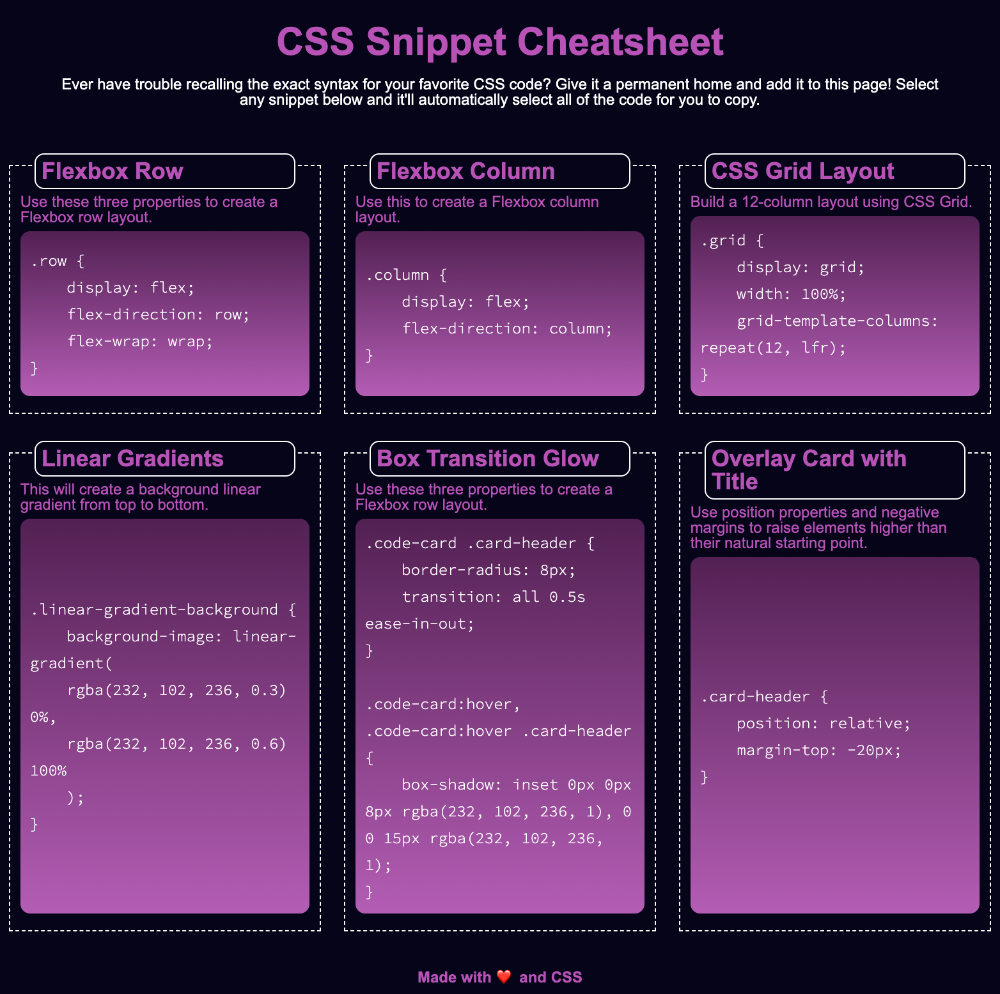
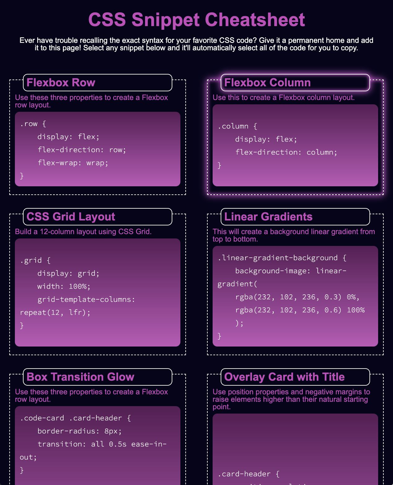
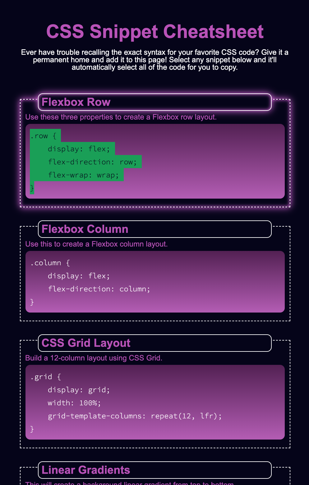

# CSS Cheat Sheet
This project is to create a web page of CSS cheat sheet.

## Getting Started
```console
git clone https://github.com/qtian13/CSS-cheat-sheet.git
```

## Built With

* [HTML](https://developer.mozilla.org/en-US/docs/Web/HTML)
* [CSS](https://developer.mozilla.org/en-US/docs/Web/CSS)

## Description of the CSS Cheat Sheet Page
1. The Horiseon Page consists of 4 parts:  the main header,  the page function description, 6 code cards and the footer
1. The snippets layout responsively. 
    * Three snippets each row for desktop screen (screen width no less than 992px)
    * Two snippets each row for tablet screen (screen width less than 992px while no less than 768)
    * One snippet each row for mobile screen (scree width less than 768)
1. The snippets in the same row are of equal height
1. The sample code block automatically stretches to fill the snippet block and the code is vertically centered.
1. The snippet border and its title border glow when the mouse hover over the snippet block.
1. The Sample code can be selected when sample block was clicked

## Page URL
https://qtian13.github.io/CSS-cheat-sheet/

## Page Screen Shot with Different Screen Width





## Authors
Qiushuang Tian
- [Link to Portfolio Site](#)
- [Link to Github](https://github.com/qtian13)
- [Link to LinkedIn](https://www.linkedin.com/in/qiushuang-tian-a9754248/)

Huiran Lin
- [Link to Github](https://github.com/hugh18019)


## Acknowledgments

- [Berkeley Coding Boot Camp](https://bootcamp.berkeley.edu/coding/) provided Mock Up Image


