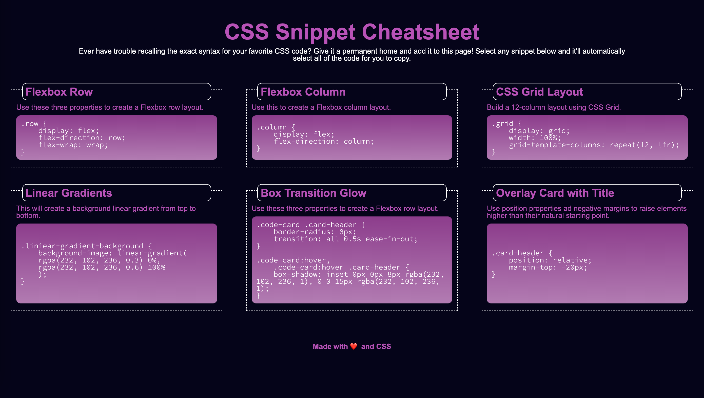
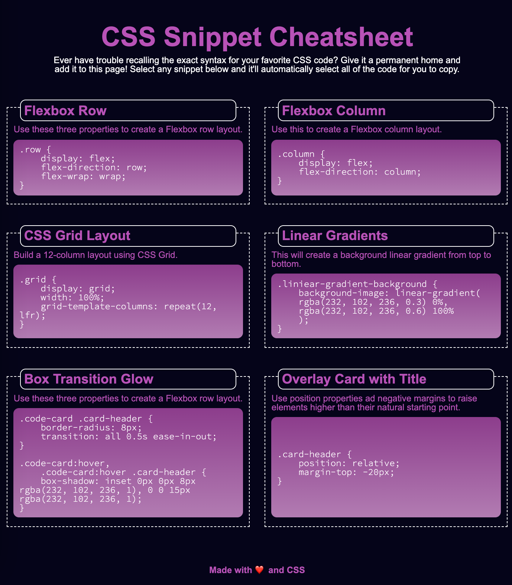
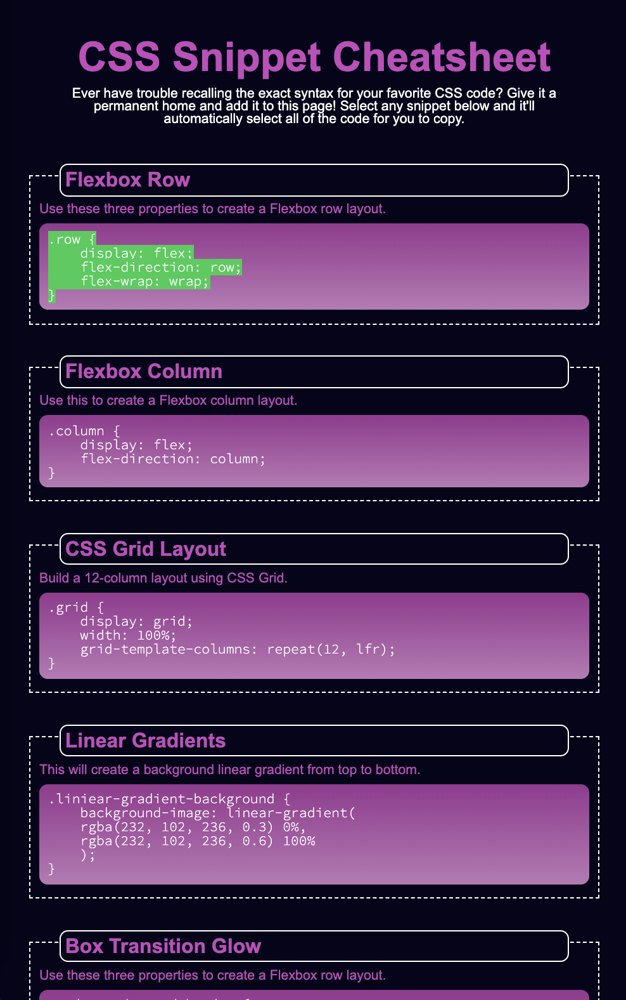

# CSS Cheat Sheet
This project is to create a web page of CSS cheat sheet.

## Getting Started
```console
git clone https://github.com/qtian13/CSS-cheat-sheet.git
```

## Built With

* [HTML](https://developer.mozilla.org/en-US/docs/Web/HTML)
* [CSS](https://developer.mozilla.org/en-US/docs/Web/CSS)

## Description of the CSS Cheat Sheet Page
1. The Horiseon Page consists of 4 parts :  main header, description of the page, different snippet of CSS syntax, footer
1. Select any snippet and its code would be copied automatically
1. The page is screen responsive. 
    * On the screen of width no less than 992px, there are 3 snippets each row
    * On the screen of width less than 992px but no less than 768, there are 2 snippets each row
    * On the screen of width less than 768, there is only 1 snippets each row
1. The snippets are evenly spead the width of the screen with equal height of the other sniptes in the same row
1. The code part auto matically stretches to fill the extra space in the snippet with the code centered vertically.

## Page URL
https://qtian13.github.io/CSS-cheat-sheet/

## Page Screen Shot with Different Screen Width





## Authors
Qiushuang Tian
- [Link to Portfolio Site](#)
- [Link to Github](https://github.com/qtian13)
- [Link to LinkedIn](https://www.linkedin.com/in/qiushuang-tian-a9754248/)

Huiran Lin
- [Link to Github](https://github.com/hugh18019)


## Acknowledgments

- [Berkeley Coding Boot Camp](https://bootcamp.berkeley.edu/coding/) provided Mock Up Image


